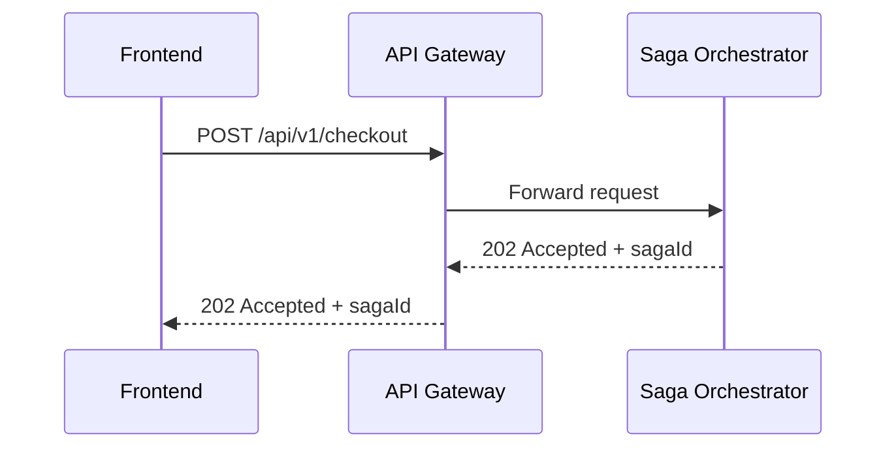

# Task: bookstore-api-gateway

## 1. Tong quan

`bookstore-api-gateway` la cua vao HTTP cua he thong. Khi checkout chuyen sang Saga Orchestrator, gateway phai dua request moi den `saga-orchestrator-service` thay vi de frontend goi truc tiep flow checkout cu trong `order-service`.

Gateway khong xu ly nghiep vu saga. Vai tro cua no la:

- route dung request,
- giu auth header,
- giu CORS va cac chinh sach chung.

## 2. Nhiem vu cu the

1. Them route:
   - Path: `/api/v1/checkout/**`
   - URI: `http://saga-orchestrator-service:8080`
2. Ap dung route nay cho ca profile `dev` va `prod`.
3. Dam bao `X-User-Id` hoac thong tin user sau auth van duoc truyen tiep sang orchestrator.
4. Khi migrate xong frontend, khong de endpoint checkout moi bi trung nghia voi flow cu trong `order-service`.
5. Cap nhat tai lieu route neu gateway co README hoac bang API noi bo.
6. Test toi thieu:
   - gateway boot duoc,
   - route `/api/v1/checkout/**` duoc load,
   - request co auth header van di qua dung.

## 3. Minh hoa



Vi du route:

```yaml
- id: saga-orchestrator-service
  uri: http://saga-orchestrator-service:8080
  predicates:
    - Path=/api/v1/checkout/**
```
