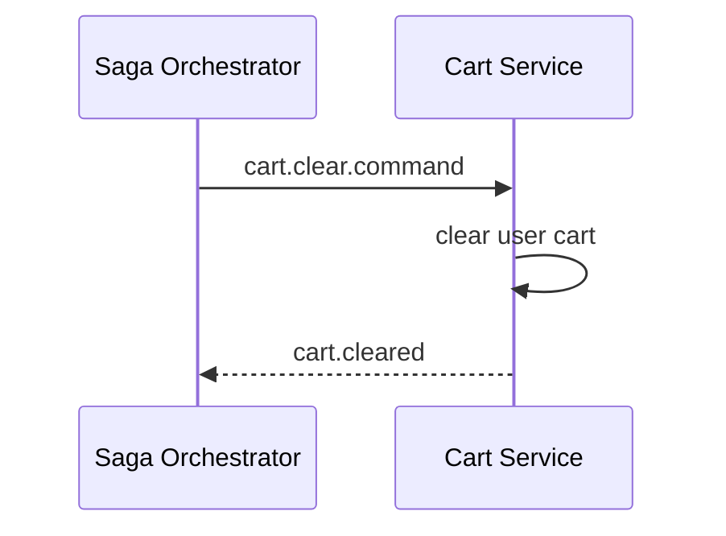

# Task: bookstore-cart-service

## 1. Tong quan

`bookstore-cart-service` khong tham gia vao cac quyet dinh kho, payment hay shipment. Vai tro cua no trong saga la don gian nhung quan trong:

- chi clear cart khi checkout da thanh cong that su.

Khong nen de frontend tu clear cart vi UI khong phai la nguon su that cua business transaction.

## 2. Nhiem vu cu the

1. Tao consumer cho:
   - `cart.clear.command`
2. Khi nhan command:
   - xoa gio hang cua `userId`,
   - xu ly idempotent,
   - publish `cart.cleared`.
3. Neu cart da rong:
   - van tra ket qua thanh cong,
   - khong coi la loi.
4. Khong clear cart:
   - khi moi tao order,
   - khi payment con `PENDING`,
   - khi frontend tu suy doan checkout thanh cong.
5. Them test cho:
   - clear thanh cong,
   - clear lap lai,
   - cart da rong.

## 3. Minh hoa



Nguyen tac nho nhanh:

```text
checkout.completed truoc, clear cart sau
```
