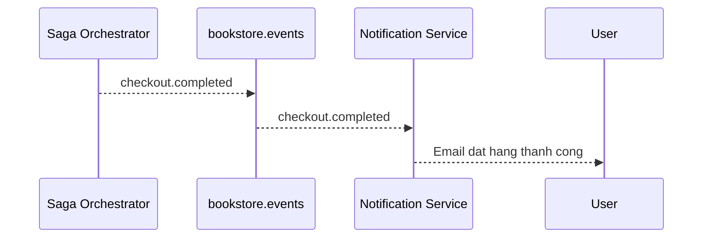

# Task: bookstore-notification-service

## 1. Tong quan

`bookstore-notification-service` chi la subscriber sau cung cua business flow. Gui mail loi khong duoc lam rollback order, payment hay stock.

Service nay can nghe event chuan tu `bookstore.events` va gui thong bao phu hop cho user.

## 2. Nhiem vu cu the

1. Chuan hoa exchange lang nghe sang:
   - `bookstore.events`
2. Lang nghe toi thieu cac event:
   - `checkout.completed`
   - `checkout.failed`
   - `payment.completed`
   - `order.cancelled`
3. Chuan hoa DTO/payload nhan vao de tranh tinh trang moi producer gui mot shape khac nhau.
4. Tao template thong bao ro rang cho:
   - dat hang thanh cong,
   - checkout that bai,
   - thanh toan thanh cong,
   - don bi huy.
5. Neu gui mail loi:
   - retry,
   - dua vao DLQ khi can,
   - khong phat event quay nguoc lam hong saga.
6. Log theo `sagaId` va `orderId` de truy vet.

## 3. Minh hoa

Phan biet ro:

| Event | Co rollback business khong |
|---|---|
| `checkout.completed` | Khong |
| `checkout.failed` | Khong |
| Email gui loi | Khong |
