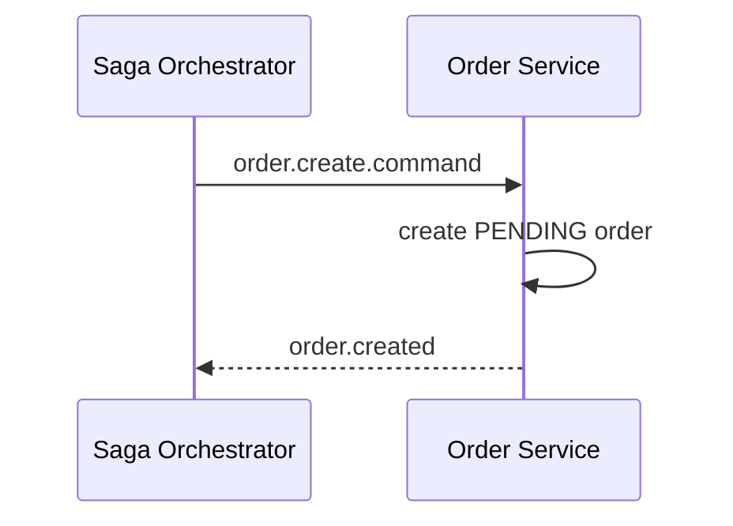

# Task: bookstore-order-service

## 1. Tong quan

`bookstore-order-service` chi nen so huu du lieu va trang thai cua don hang. Sau khi ap dung saga, service nay khong con la noi tu dieu phoi stock, promotion, payment va shipping nua.

Muc tieu la bien `order-service` thanh mot participant ro rang trong saga:

- nhan command,
- cap nhat order cua chinh minh,
- publish event ket qua.

## 2. Nhiem vu cu the

1. Tao consumer cho:
   - `order.create.command`
   - `order.confirm.command`
   - `order.cancel.command`
2. Khi nhan `order.create.command`:
   - tao order `PENDING`,
   - lay va luu snapshot dia chi/gia tri can thiet,
   - khong tru kho truc tiep,
   - khong tu goi payment,
   - publish `order.created`.
3. Khi nhan `order.confirm.command`:
   - chuyen order sang `CONFIRMED`,
   - publish `order.confirmed`.
4. Khi nhan `order.cancel.command`:
   - chuyen order sang `CANCELLED`,
   - publish `order.cancelled`.
5. Neu tao/cap nhat order loi:
   - publish `order.failed` kem `reason`.
6. Loai dan logic orchestration cu khoi flow checkout cu:
   - khong goi `book-service` de tru kho,
   - khong goi `payment-service` de tu tao payment URL,
   - khong tu dieu phoi cac service khac.
7. Them idempotency:
   - cung mot `eventId` khong duoc xu ly hai lan,
   - cung mot `sagaId` khong duoc tao nhieu order trung lap.

## 3. Minh hoa

| Command nhan | Viec order-service lam | Event tra ve |
|---|---|---|
| `order.create.command` | Tao order `PENDING` | `order.created` |
| `order.confirm.command` | Doi sang `CONFIRMED` | `order.confirmed` |
| `order.cancel.command` | Doi sang `CANCELLED` | `order.cancelled` |

