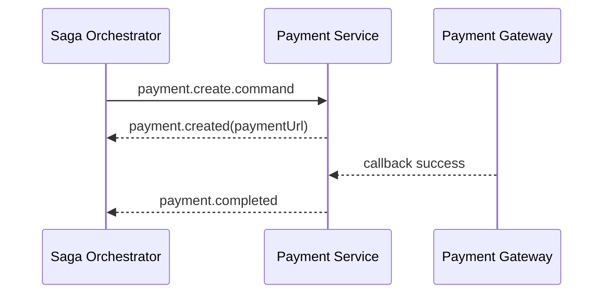

# Task: bookstore-payment-service

## 1. Tong quan

`bookstore-payment-service` la participant quan trong nhat cua flow online payment. Service nay can tao payment, nhan callback tu cong thanh toan, publish ket qua va ho tro refund neu cac buoc sau do bi loi.

Payment service khong duoc tu confirm order. Viec dieu phoi tiep theo thuoc ve orchestrator.

## 2. Nhiem vu cu the

1. Tao consumer cho:
   - `payment.create.command`
   - `payment.refund.command`
2. Khi nhan `payment.create.command`:
   - tao payment `PENDING`,
   - luu `sagaId`, `orderId`, `userId`, `paymentMethod`,
   - tao payment URL,
   - publish `payment.created`.
3. Khi callback tu cong thanh toan thanh cong:
   - cap nhat payment `COMPLETED`,
   - publish `payment.completed`.
4. Khi callback that bai hoac het han:
   - cap nhat payment `FAILED`,
   - publish `payment.failed`.
5. Khi nhan `payment.refund.command`:
   - goi refund neu payment da thu tien,
   - publish `payment.refunded`.
6. Chuyen event domain sang exchange chuan `bookstore.events`.
7. Khong de `order-service` phai consume rieng flow payment cu de tu confirm order.
8. Them idempotency:
   - callback lap lai khong doi trang thai sai,
   - refund lap lai khong refund hai lan.

## 3. Minh hoa



Neu `shipping-service` fail sau khi da thu tien:

```text
SO -> PAY: payment.refund.command
PAY -> SO: payment.refunded
```
