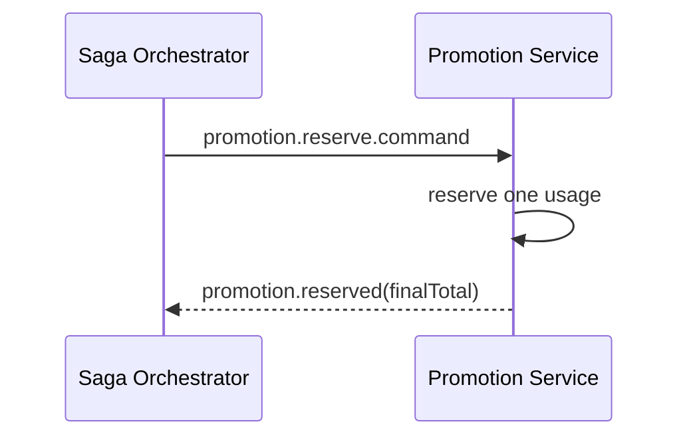

# Task: bookstore-promotion-service

## 1. Tong quan

`bookstore-promotion-service` can tach ro hai viec:

- preview/validate ma giam gia cho UI,
- giu mot luot su dung that su trong checkout saga.

Neu khong co reservation, mot ma co gioi han so luot co the bi dung vuot muc khi nhieu user checkout cung luc.

## 2. Nhiem vu cu the

1. Tao reservation model theo `sagaId`:
   - `RESERVED`
   - `CONFIRMED`
   - `RELEASED`
2. Tao consumer cho:
   - `promotion.reserve.command`
   - `promotion.confirm.command`
   - `promotion.release.command`
3. Khi reserve:
   - kiem tra ma con hop le,
   - kiem tra gioi han su dung,
   - giu mot luot dung tam thoi,
   - tinh `finalTotal`,
   - publish `promotion.reserved`.
4. Khi confirm:
   - chot luot su dung,
   - publish `promotion.confirmed`.
5. Khi release:
   - tra lai luot giu tam neu saga fail,
   - publish `promotion.released`.
6. Khi ma khong hop le hoac vuot limit:
   - publish `promotion.failed`.
7. Them idempotency theo `sagaId` de mot lenh retry khong tao nhieu reservation.
8. Giu endpoint preview cu neu frontend van can xem truoc muc giam gia, nhung preview khong duoc xem la da giu ma.

## 3. Minh hoa

| Buoc | Trang thai reservation |
|---|---|
| User moi preview ma | Chua tao reservation |
| Nhan `promotion.reserve.command` | `RESERVED` |
| Checkout thanh cong | `CONFIRMED` |
| Payment fail / timeout | `RELEASED` |

