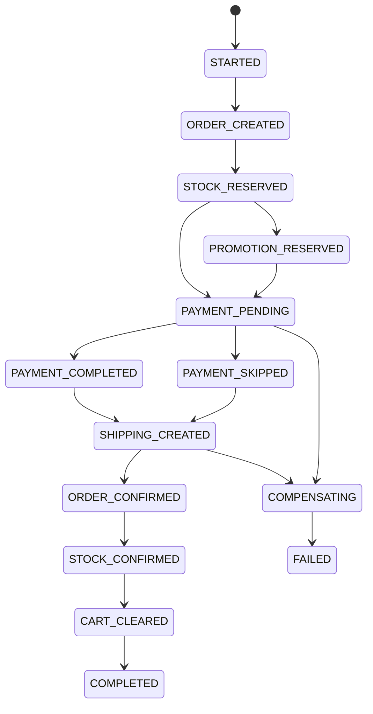

# Task: bookstore-saga-orchestrator-service

## 1. Tong quan

`bookstore-saga-orchestrator-service` la trung tam dieu phoi flow checkout. Service nay khong so huu order, stock, payment hay shipment cua cac service khac; no chi:

- tao `sagaId`,
- gui command,
- nhan event ket qua,
- cap nhat state machine,
- quyet dinh compensation khi co loi.

Phan khung service da duoc tao, nhung nguoi bao tri sau nay can giu ro ranh gioi: orchestrator dieu phoi, khong chen vao database cua service khac.

## 2. Nhiem vu cu the

1. Duy tri 2 API:
   - `POST /api/v1/checkout`
   - `GET /api/v1/checkout/{sagaId}`
2. Duy tri state machine checkout:
   - `STARTED`
   - `ORDER_CREATED`
   - `STOCK_RESERVED`
   - `PROMOTION_RESERVED`
   - `PAYMENT_PENDING`
   - `PAYMENT_SKIPPED`
   - `PAYMENT_COMPLETED`
   - `SHIPPING_CREATED`
   - `ORDER_CONFIRMED`
   - `STOCK_CONFIRMED`
   - `PROMOTION_CONFIRMED`
   - `CART_CLEARED`
   - `COMPLETED`
   - `COMPENSATING`
   - `FAILED`
3. Duy tri command producer va event consumer tren:
   - `bookstore.commands`
   - `bookstore.events`
4. Duy tri idempotency bang `processed_message`.
5. Hoan thien phan tang do ben vung:
   - transactional outbox,
   - retry/backoff,
   - DLQ,
   - metric theo `sagaId`,
   - integration test RabbitMQ + MySQL.
6. Duy tri compensation nguoc thu tu:
   - cancel shipping,
   - refund payment,
   - release promotion,
   - release stock,
   - cancel order.
7. Khong compensation khi:
   - saga da `COMPLETED`,
   - loi xay ra ngay khi con `STARTED` va chua co tai nguyen nao can rollback.

## 3. Minh hoa

Vi du:

- Nhan `promotion.failed` khi saga dang `STOCK_RESERVED`
- Orchestrator gui:
  1. `book.stock.release.command`
  2. `order.cancel.command`
- Cuoi cung publish `checkout.failed`
