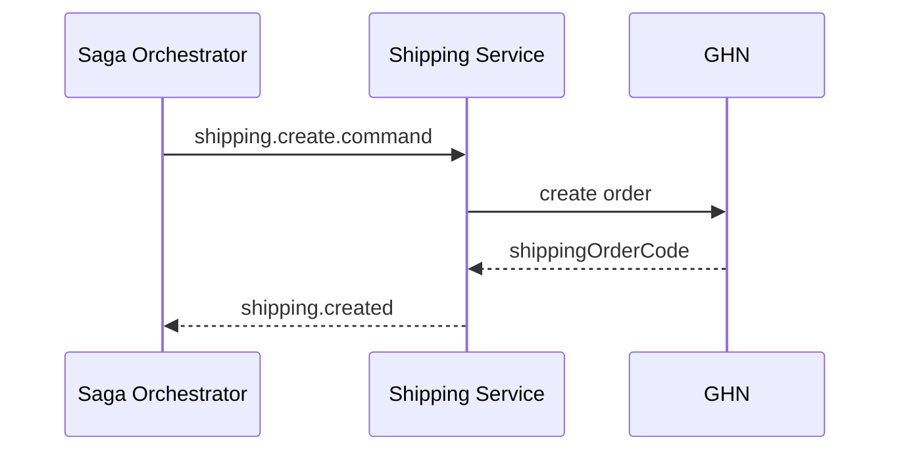

# Task: bookstore-shipping-service

## 1. Tong quan

`bookstore-shipping-service` tao va huy van don. Trong saga moi, shipment chi duoc tao sau khi:

- COD da qua cac buoc reserve can thiet, hoac
- online payment da thanh cong.

Neu shipment fail, orchestrator se quyet dinh compensation tiep theo.

## 2. Nhiem vu cu the

1. Tao consumer cho:
   - `shipping.create.command`
   - `shipping.cancel.command`
2. Khi nhan `shipping.create.command`:
   - tao shipment voi GHN,
   - luu mapping `sagaId`, `orderId`, `shippingOrderCode`,
   - voi COD, nhan dung `codAmount`,
   - publish `shipping.created`.
3. Khi tao shipment that bai:
   - publish `shipping.failed` kem `reason`.
4. Khi nhan `shipping.cancel.command`:
   - huy dung shipment theo `shippingOrderCode`,
   - publish `shipping.cancelled`.
5. Them idempotency:
   - cung mot `sagaId` khong tao nhieu shipment,
   - cancel lap lai khong sinh loi nghiep vu.
6. Co retry hop ly cho loi tam thoi tu GHN, nhung khong nuot loi den muc orchestrator khong biet ket qua.

## 3. Minh hoa

| Command nhan | Hanh dong | Event tra ve |
|---|---|---|
| `shipping.create.command` | Tao van don | `shipping.created` |
| `shipping.cancel.command` | Huy van don | `shipping.cancelled` |

